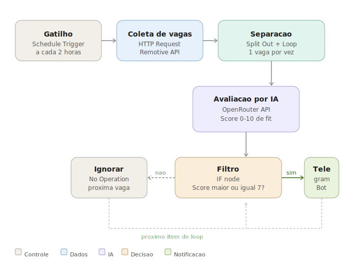

# 🤖 Job Fit Agent

Agente de IA que monitora vagas automaticamente e só te notifica quando o fit é alto.


## O problema

Monitorar vagas manualmente é ineficiente: centenas de resultados, 90% irrelevantes, e as boas passam despercebidas. Queria ser notificado apenas quando uma vaga realmente valesse minha atenção.

## A solução

Um agente n8n que roda a cada 2 horas, busca vagas via API, passa cada uma por um modelo de IA que avalia o fit de 0 a 10, e envia notificação no Telegram somente se a nota for >= 7.

## Como funciona



## Stack

| Camada | Tecnologia |
|--------|-----------|
| Orquestração | n8n (self-hosted via Docker) |
| IA / Avaliação | OpenRouter API (GPT-4o free tier) |
| Fonte de vagas | Remotive API |
| Notificação | Telegram Bot API |

## Como rodar localmente

### 1. Suba o n8n via Docker

```bash
docker run -d \
  --name n8n \
  --restart unless-stopped \
  -p 5678:5678 \
  -v ~/.n8n:/home/node/.n8n \
  -e GENERIC_TIMEZONE="America/Sao_Paulo" \
  docker.n8n.io/n8nio/n8n
```

### 2. Configure as variáveis de ambiente

```bash
cp .env.example .env
```

```env
OPENROUTER_API_KEY=sk-or-sua_chave_aqui
TELEGRAM_BOT_TOKEN=seu_token_aqui
TELEGRAM_CHAT_ID=seu_chat_id_aqui
```

### 3. Importe o fluxo

Acesse http://localhost:5678 → Menu ⋯ → Import from file → selecione workflow/Job_Fit_Agent.json

### 4. Ative o workflow

Clique em Publish → ative o toggle Active.

## Decisões técnicas

**Por que OpenRouter?** Permite usar múltiplos modelos de IA com uma única API, incluindo modelos gratuitos.

**Por que Remotive API?** API pública, sem autenticação, estável e com boas vagas remotas de tech.

**Por que score numérico?** Facilita o filtro no IF node e dá uma métrica clara para ajustar o threshold.

## Roadmap

- [x] Triagem via IA com score numérico
- [x] Notificação via Telegram
- [x] Filtro por threshold configurável
- [x] Deploy via Docker local
- [ ] Integração com LinkedIn via Apify
- [ ] Deduplicação para evitar notificações repetidas
- [ ] Dashboard de vagas salvas no Notion

## Licença

MIT © [Felipe Santos](https://github.com/feasantos) · [LinkedIn](https://www.linkedin.com/in/feasantos/)
